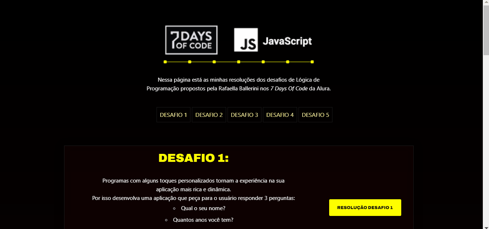

<h1 align="center">7 Days Of Code</h1>

 <a href="#-tecnologias">Tecnologias</a> •
 <a href="#-demo">Demo</a> •
 <a href="#autor">Autor</a>

Nessa página está as minhas resoluções dos desafios de Lógica de Programação propostos pela Rafaella Ballerini nos '7 Days Of Code' da Alura.

---

<h1 align="center">
  
</h1>

---
 
### 🛠 Tecnologias:

As seguintes ferramentas foram usadas na construção do projeto:

---

### 💻 Demo:

---

### Autor:

Feito com ❤️ por Giselle Souza. 👋
 
